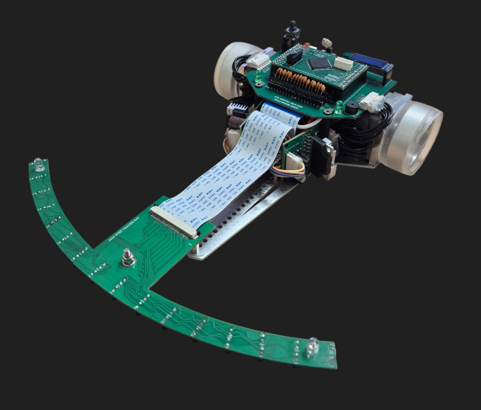

# StepTracer_Ray

<p align="center">
  
  
  
  
</p>

StepTracer_Ray is a competition-oriented line tracer project built around repeated runs on the same track.
Instead of driving every lap with the same logic, the robot improves its strategy step by step: it first learns the course, then replays it faster, and finally applies more aggressive tuning for maximum performance.

That multi-stage race strategy is the core idea of this project.

## Hardware Image



## Demo Video

- 3rd race video: [`assets/videos/third-race.mp4`](assets/videos/third-race.mp4)

## PCB Files

- `HardWare/2025_PCB/`: archived PCB project files from the previous board set
- `HardWare/2026_PCB/`: updated PCB project files for `main_board.eprj`, `sensor_board.eprj`, and `motor_driver.eprj`

## Overview

The project is organized around three race stages:

- **1st race**: search and map generation
- **2nd race**: map-based fast replay
- **3rd race**: advanced tuning with trajectory shift and gain scheduling

The recorded race data is stored in `search_info[]`, which is then reused by the later runs.

## Race Strategy

### 1st Race - Search Run

The first race is the learning phase.

During this run, the robot follows the line while detecting turn marks, measuring distances between sections, and recording track information. The collected data is stored in `search_info[]` and later written to ROM so the next race can reuse the course map.

In short, the goal of the first race is reliable completion and track memorization.

### 2nd Race - Fast Run

The second race is the replay phase based on the recorded map.

After loading the saved track data, the robot classifies each section as straight, 45-degree turn, 90-degree turn, 180-degree turn, 270-degree turn, or large turn. Based on that information, it calculates acceleration, deceleration distance, entry speed, exit speed, and maximum speed for each segment.

Because the course is already known, the robot can drive more aggressively on straights and prepare for corners earlier than in the first race.

### 3rd Race - Extreme Run

The third race is the fully optimized performance phase.

This stage keeps the map-based replay logic from the second race, but adds more advanced tuning such as:

- target position shift before and after corners
- corner-group speed optimization
- adaptive `Kp` control
- more detailed acceleration planning

Instead of always following the line with the same center position, the robot intentionally shifts its trajectory depending on corner shape and surrounding track pattern. This allows faster and smoother cornering.

Related demo:

- 3rd race run video: [`assets/videos/third-race.mp4`](assets/videos/third-race.mp4)

## Core Modules

- `main.c`  
  System initialization and startup flow.

- `sensor.c`  
  Sensor sampling, normalization, line position calculation, cross detection, turn mark detection, and start/end detection.

- `Motor.c`  
  Motion control, distance accumulation, acceleration/deceleration logic, and third-race control behavior.

- `search.c`  
  First-race mapping logic.

- `fastrun.c`  
  Second-race speed planning and replay logic.

- `extremerun.c`  
  Third-race advanced tuning logic.

- `Rom.c`  
  Save/load logic for calibration data and recorded race data.

- `menu.c`  
  Menu interface for selecting race modes and tuning values.

## Technical Highlights

- 16-sensor line detection system
- weighted position calculation for smooth steering
- track memorization through first-run mapping
- turn classification based on recorded segment distance
- per-section velocity and deceleration planning
- third-run lateral shift and gain scheduling
- interrupt-driven sensor and motor control loop

## Position Low-Pass Filter

The STM32 control loop samples the line position every `200 us` (`5 kHz`). A first-order low-pass filter is used to reduce abrupt position changes and high-frequency sensor noise before the filtered position is used by the steering controller.

The continuous-time filter is

```text
         wc
H(s) = -------,    wc = 2*pi*Fc
       s + wc
```

Applying the Tustin transform

```text
    2   1 - z^-1
s = - * --------
    T   1 + z^-1
```

produces the discrete coefficients

```text
Kb = wc*T / (2 + wc*T)
Ka = (wc*T - 2) / (2 + wc*T)
```

and the difference equation

```text
y[n] = Kb * (x[n] + x[n-1]) - Ka * y[n-1]
```

which maps directly to C:

```c
filtered_position = Kb * (current_position + previous_position)
                    - Ka * previous_filtered_position;
```

With the current default `Fc = 80 Hz` and `T = 0.0002 s`, the coefficients are `Kb = 0.04786` and `Ka = -0.90428`. For a position step from `0` to `5000`, the filtered output starts approximately as `239 -> 695 -> 1107`, instead of jumping directly to `5000`.

The filtered position is used for the proportional term, while its sample-to-sample difference is used for the derivative term:

```text
P = Kp * y[n]
D = Kd * (y[n] - y[n-1])
```

The cutoff frequency `Fc` is adjustable from the OLED menu. Lower values provide stronger smoothing but slower response; higher values follow the line position faster but pass more sensor noise.

## Detailed Code Analysis

- Third-race deep dive: [`docs/extremerun-analysis.md`](docs/extremerun-analysis.md)
- Focus areas: `SofteWare/Initial_3rd_Code/main/extremerun.c` and `SofteWare/Initial_3rd_Code/main/Motor.c`

## Project Idea

This is not just a basic line follower. It is a staged racing system that combines sensing, memory, motion planning, and control tuning to improve lap performance across multiple runs.

The overall idea can be summarized as:

1. learn the course,
2. replay the course faster,
3. optimize the trajectory and control for the best run.
